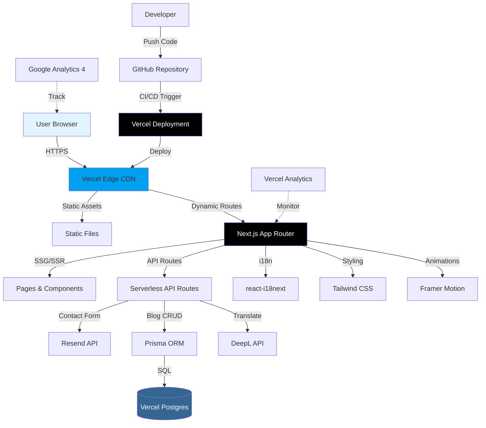
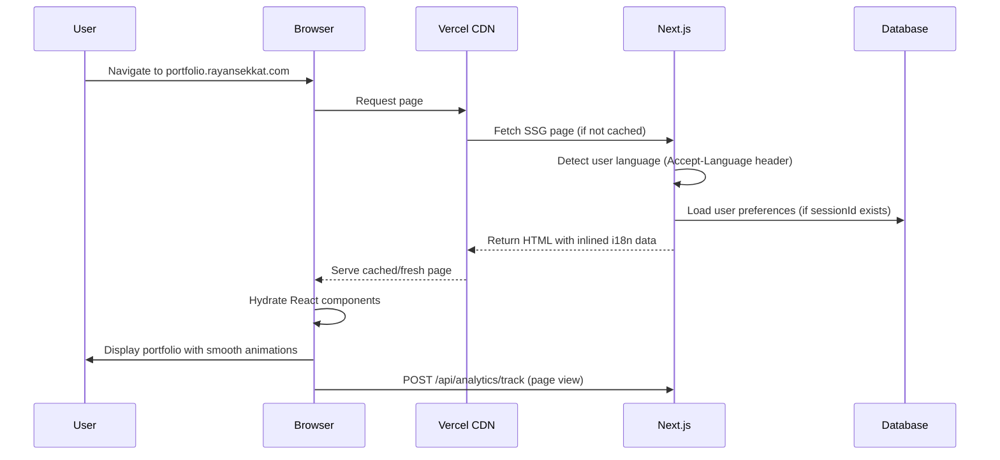
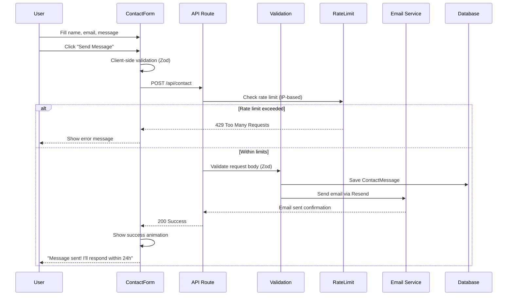
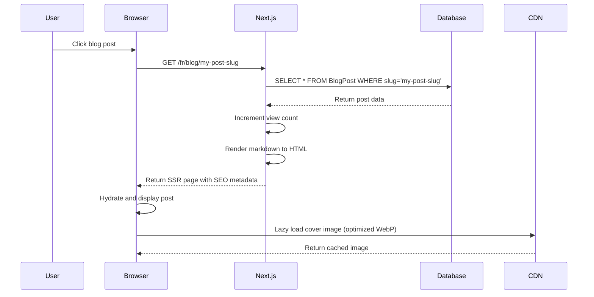
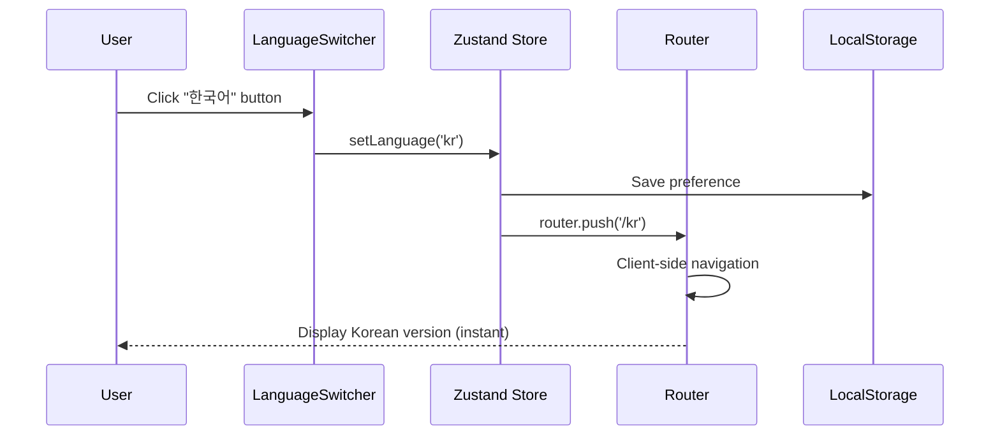
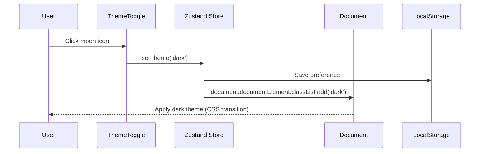
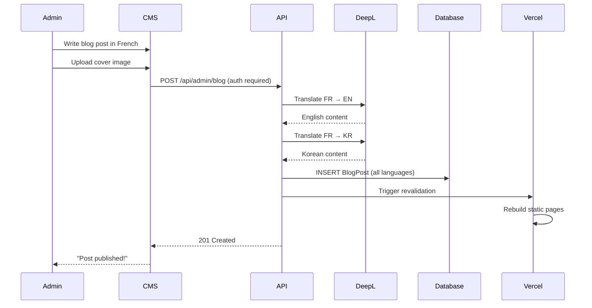
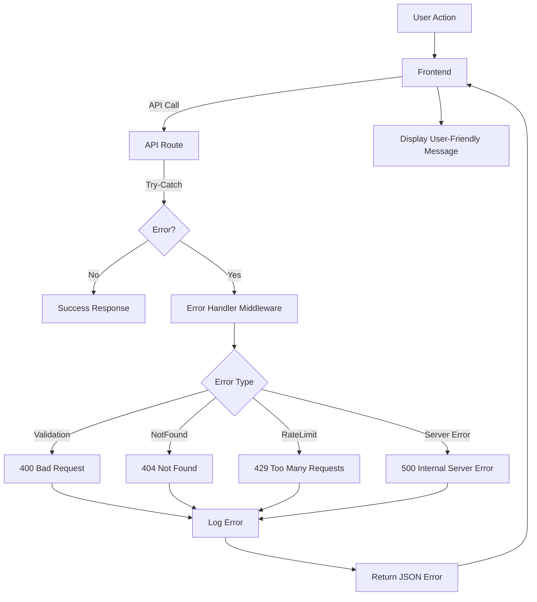

# Portfolio AI-Powered Full-Stack Developer - Architecture Document

## Introduction

This document outlines the complete fullstack architecture for the AI-Powered Full-Stack Developer Portfolio, including backend systems, frontend implementation, and their integration. It serves as the single source of truth for AI-driven development, ensuring consistency across the entire technology stack.

This unified approach combines what would traditionally be separate backend and frontend architecture documents, streamlining the development process for modern fullstack applications where these concerns are increasingly intertwined.

### Starter Template or Existing Project

**Starter Template:** N/A - Greenfield project

**Approach:** Starting from Next.js 14+ official create-next-app with TypeScript and App Router enabled. The project will follow modern Next.js best practices with custom configuration for Tailwind CSS, Prisma ORM, and pnpm workspace structure as specified in the PRD.

**Constraints:** None - full architectural freedom within Next.js framework conventions.

### Change Log

| Date       | Version | Description                           | Author              |
| ---------- | ------- | ------------------------------------- | ------------------- |
| 2026-01-24 | 1.0     | Initial architecture document created | Winston (Architect) |

---

## High Level Architecture

### Technical Summary

This portfolio application follows a **modern Jamstack architecture** leveraging Next.js 14+ App Router for hybrid SSR/SSG rendering with serverless API routes. The frontend utilizes React 18+ with TypeScript for type safety, Tailwind CSS for styling, and Framer Motion for animations. The backend is implemented through Next.js API routes providing RESTful endpoints for contact form submission and blog article retrieval.

The application deploys to **Vercel's edge network** with automatic CI/CD from GitHub, utilizing PostgreSQL (Vercel Postgres) for structured data storage accessed via Prisma ORM. Internationalization is managed through react-i18next with DeepL API integration for high-quality FR/EN/KR translations. The architecture prioritizes **performance-first design** targeting Lighthouse 95+ scores through aggressive optimization: image optimization, code splitting, lazy loading, and edge caching.

Key integration points include EmailJS/Resend for contact form delivery, DeepL API for translation automation, and Vercel Analytics for real-time performance monitoring. The monorepo structure (pnpm workspace) enables shared TypeScript types and utilities across the application while maintaining clear separation of concerns.

### Platform and Infrastructure Choice

**Platform:** Vercel Edge Network

**Key Services:**

- **Hosting:** Vercel (Frontend + Serverless Functions)
- **Database:** Vercel Postgres (PostgreSQL)
- **CDN:** Vercel Edge Network (automatic)
- **Email Delivery:** Resend API (Vercel-native) or EmailJS
- **Translation:** DeepL API
- **Analytics:** Vercel Analytics + Google Analytics 4
- **CI/CD:** GitHub integration with Vercel

**Deployment Host and Regions:** Global edge network with automatic geographic distribution (Vercel Edge)

### Repository Structure

**Structure:** Monorepo with pnpm workspaces

**Monorepo Tool:** pnpm workspaces (chosen for performance and efficient node_modules handling)

**Package Organization:**

- **Root:** Global configuration (ESLint, Prettier, TypeScript, Husky)
- **apps/web:** Main Next.js application (frontend + API routes)
- **packages/shared:** Shared TypeScript types, constants, and utilities
- **packages/ui:** Reusable UI components (optional for future extraction)

### High Level Architecture Diagram



### Architectural Patterns

- **Jamstack Architecture:** Static site generation with serverless APIs for dynamic functionality - _Rationale:_ Optimal performance (Lighthouse 95+) while maintaining flexibility for contact forms and blog management

- **Hybrid Rendering (SSG + SSR):** Static generation for main portfolio sections, server-side rendering for blog articles - _Rationale:_ Maximum performance for static content with SEO benefits for dynamic blog posts

- **Component-Based UI:** Atomic design with reusable React components and TypeScript interfaces - _Rationale:_ Maintainability, type safety, and consistent UI across all sections

- **API Routes Pattern:** Next.js API routes as BFF (Backend for Frontend) - _Rationale:_ Collocated with frontend code, automatic serverless deployment, simpler than separate backend service

- **Repository Pattern:** Prisma as abstraction over database access - _Rationale:_ Type-safe queries, easy migrations, future database flexibility

- **Service Layer Pattern:** Separate business logic from API routes - _Rationale:_ Testability, reusability, clear separation of concerns

- **Optimistic UI Updates:** Immediate UI feedback with background API calls - _Rationale:_ Perceived performance improvement for user interactions

- **Progressive Enhancement:** Core functionality works without JavaScript, enhanced with React - _Rationale:_ Accessibility, SEO, resilience

- **CSS-in-JS via Tailwind:** Utility-first styling with design tokens - _Rationale:_ Rapid development, consistent design system, built-in dark mode support

- **Internationalization Pattern:** Server-side translation loading with client-side switching - _Rationale:_ SEO-friendly multilingual support without page reloads

---

## Tech Stack

This is the DEFINITIVE technology selection for the entire project. All development must use these exact versions.

| Category                 | Technology                   | Version              | Purpose                         | Rationale                                                                                             |
| ------------------------ | ---------------------------- | -------------------- | ------------------------------- | ----------------------------------------------------------------------------------------------------- |
| **Frontend Language**    | TypeScript                   | 5.3+                 | Type-safe frontend development  | Catches errors at compile-time, enables better IDE support, aligns with modern React patterns         |
| **Frontend Framework**   | Next.js                      | 14.1+                | React framework with SSR/SSG    | App Router for modern routing, built-in optimization, serverless API routes, Vercel-native deployment |
| **UI Library**           | React                        | 18.2+                | Component-based UI              | Industry standard, excellent TypeScript support, large ecosystem, Suspense for async UI               |
| **UI Component Library** | Headless UI + Radix UI       | Latest               | Accessible unstyled components  | WCAG AA compliance out of the box, works seamlessly with Tailwind, no design opinions                 |
| **CSS Framework**        | Tailwind CSS                 | 3.4+                 | Utility-first styling           | Rapid development, built-in dark mode, tree-shaking for small bundles, design tokens                  |
| **Animation Library**    | Framer Motion                | 11.0+                | Declarative animations          | Smooth 60fps animations, scroll-triggered effects, gesture support, excellent React integration       |
| **State Management**     | Zustand                      | 4.5+                 | Lightweight state management    | Simpler than Redux, TypeScript-first, minimal boilerplate, sufficient for portfolio complexity        |
| **Data Fetching**        | TanStack Query (React Query) | 5.0+                 | Server state management         | Caching, automatic refetching, optimistic updates, error handling, perfect for API routes             |
| **Backend Language**     | Node.js                      | 20 LTS               | JavaScript runtime              | Required for Next.js, LTS version for stability, excellent package ecosystem                          |
| **Backend Framework**    | Next.js API Routes           | 14.1+                | Serverless API endpoints        | Collocated with frontend, automatic deployment, no CORS issues, TypeScript shared types               |
| **API Style**            | REST                         | N/A                  | HTTP API architecture           | Simpler than GraphQL for portfolio needs, standard HTTP methods, cacheable                            |
| **Database**             | PostgreSQL                   | 15+                  | Relational database             | ACID compliance, excellent for structured blog data, JSON support, Vercel Postgres compatible         |
| **ORM**                  | Prisma                       | 5.8+                 | Type-safe database access       | Auto-generated TypeScript types, migrations, Prisma Studio for debugging, connection pooling          |
| **Cache**                | Vercel Edge Cache            | Built-in             | HTTP caching layer              | Automatic with Vercel deployment, CDN-level caching, revalidation support                             |
| **File Storage**         | Vercel Blob Storage          | Latest               | Image/asset storage             | Vercel-native, automatic optimization, CDN distribution, sufficient for portfolio images              |
| **Authentication**       | NextAuth.js                  | 4.24+ (future)       | Auth for admin (blog CMS)       | Not MVP but ready for blog admin panel, supports multiple providers, session management               |
| **Internationalization** | next-i18next                 | 15.0+                | Multilingual support (FR/EN/KR) | Next.js-optimized i18next, server-side translation loading, SEO-friendly                              |
| **Translation API**      | DeepL API                    | v2                   | Automated translation           | Highest quality machine translation, FR↔EN↔KR support, better than Google Translate                   |
| **Email Service**        | Resend                       | Latest               | Contact form delivery           | Modern API, Vercel-friendly, generous free tier, React email templates                                |
| **Form Validation**      | Zod                          | 3.22+                | Schema validation               | TypeScript-first, runtime type checking, shared validation between frontend/backend                   |
| **Frontend Testing**     | Vitest + Testing Library     | 1.2+ / 14.0+         | Unit & integration tests        | Faster than Jest, ESM-native, React Testing Library for component testing                             |
| **Backend Testing**      | Vitest                       | 1.2+                 | API route testing               | Same test runner as frontend, fast, TypeScript support                                                |
| **E2E Testing**          | Playwright                   | 1.41+                | End-to-end browser testing      | Multi-browser support, auto-wait, network interception, excellent reporting                           |
| **Linting**              | ESLint                       | 8.56+                | Code quality & style            | TypeScript support, Next.js config, Prettier integration, pre-commit hooks                            |
| **Code Formatting**      | Prettier                     | 3.2+                 | Consistent code style           | Auto-formatting, Tailwind plugin for class sorting, pre-commit integration                            |
| **Package Manager**      | pnpm                         | 8.14+                | Dependency management           | 2x faster than npm, efficient disk usage, strict node_modules, workspace support                      |
| **Build Tool**           | Next.js built-in             | 14.1+                | Compilation & bundling          | Turbopack (Rust-based), SWC compiler, automatic code splitting                                        |
| **Bundler**              | Turbopack (Next.js)          | Built-in             | Fast refresh & bundling         | Webpack successor, incremental compilation, optimized for Next.js                                     |
| **CI/CD**                | GitHub Actions + Vercel      | Latest               | Automated deployment            | Lint on PR, test on merge, auto-deploy to Vercel, preview deployments                                 |
| **IaC Tool**             | Vercel CLI + Config          | Latest               | Infrastructure as code          | vercel.json for configuration, environment variables via CLI/dashboard                                |
| **Monitoring**           | Vercel Analytics             | Built-in             | Core Web Vitals tracking        | Real user monitoring, Lighthouse scores, performance insights                                         |
| **Error Tracking**       | Sentry                       | 7.0+ (optional)      | Error monitoring                | Source maps, user context, performance monitoring, generous free tier                                 |
| **Analytics**            | Google Analytics 4           | Latest               | User behavior tracking          | Conversion tracking for lead generation, free, industry standard                                      |
| **Logging**              | Vercel Logs + Axiom          | Built-in / Free tier | Application logging             | Serverless function logs, searchable, retention for debugging                                         |
| **Git Hooks**            | Husky + lint-staged          | 9.0+ / 15.0+         | Pre-commit automation           | Run linting/formatting before commits, prevent bad code from entering repo                            |

---

## Data Models

### Core Domain Models

#### BlogPost

```typescript
interface BlogPost {
  id: string; // UUID
  title: Record<string, string>; // { fr: "...", en: "...", kr: "..." }
  slug: Record<string, string>; // URL-friendly version of title
  excerpt: Record<string, string>;
  content: Record<string, string>; // Full markdown content
  coverImage: string; // Vercel Blob Storage URL
  author: string; // "Rayan Sekkat"
  publishedAt: Date;
  updatedAt: Date;
  category: string; // "AI/ML" | "Web Dev" | "Backend" | "DevOps"
  tags: string[]; // ["React", "TypeScript", "AI"]
  readingTimeMinutes: number; // Auto-calculated
  viewCount: number;
  isPublished: boolean;
  seoMetadata: {
    metaDescription: Record<string, string>;
    keywords: string[];
    ogImage: string;
  };
}
```

#### ContactMessage

```typescript
interface ContactMessage {
  id: string;
  name: string;
  email: string;
  message: string;
  source: string; // "website" | "upwork" | "linkedin"
  language: "fr" | "en" | "kr";
  status: "new" | "read" | "responded" | "archived";
  createdAt: Date;
  userAgent: string; // For spam detection
  ipAddress: string; // For rate limiting
}
```

#### UserPreferences

```typescript
interface UserPreferences {
  sessionId: string;
  theme: "light" | "dark" | "system";
  language: "fr" | "en" | "kr";
  lastVisited: Date;
  pageVisits: Record<string, number>; // Track section engagement
}
```

#### SiteMetadata

```typescript
interface SiteMetadata {
  id: string;
  totalVisits: number;
  blogTotalViews: number;
  contactFormSubmissions: number;
  lastDeployedAt: Date;
  lighthouseScores: {
    performance: number;
    accessibility: number;
    bestPractices: number;
    seo: number;
    date: Date;
  };
}
```

---

## API Specification

### REST API Endpoints

**Base URL:** `https://portfolio.rayansekkat.com/api`

**OpenAPI 3.0 Specification:**

```yaml
openapi: 3.0.0
info:
  title: Portfolio API
  version: 1.0.0
  description: Backend API for AI-Powered Full-Stack Developer Portfolio

paths:
  /blog:
    get:
      summary: Get all published blog posts
      parameters:
        - name: lang
          in: query
          schema:
            type: string
            enum: [fr, en, kr]
        - name: category
          in: query
          schema:
            type: string
        - name: limit
          in: query
          schema:
            type: integer
            default: 10
      responses:
        200:
          description: List of blog posts
          content:
            application/json:
              schema:
                type: array
                items:
                  $ref: "#/components/schemas/BlogPost"

  /blog/{slug}:
    get:
      summary: Get single blog post by slug
      parameters:
        - name: slug
          in: path
          required: true
          schema:
            type: string
        - name: lang
          in: query
          schema:
            type: string
            enum: [fr, en, kr]
      responses:
        200:
          description: Blog post details
        404:
          description: Post not found

  /contact:
    post:
      summary: Submit contact form
      requestBody:
        required: true
        content:
          application/json:
            schema:
              type: object
              required: [name, email, message, language]
              properties:
                name:
                  type: string
                  minLength: 2
                  maxLength: 100
                email:
                  type: string
                  format: email
                message:
                  type: string
                  minLength: 10
                  maxLength: 2000
                language:
                  type: string
                  enum: [fr, en, kr]
      responses:
        200:
          description: Message sent successfully
        400:
          description: Validation error
        429:
          description: Rate limit exceeded

  /analytics/track:
    post:
      summary: Track page visit
      requestBody:
        content:
          application/json:
            schema:
              type: object
              properties:
                event:
                  type: string
                page:
                  type: string
                sessionId:
                  type: string
      responses:
        204:
          description: Event tracked

components:
  schemas:
    BlogPost:
      type: object
      properties:
        id:
          type: string
        title:
          type: object
        slug:
          type: object
        excerpt:
          type: object
        content:
          type: object
        coverImage:
          type: string
        publishedAt:
          type: string
          format: date-time
        category:
          type: string
        tags:
          type: array
          items:
            type: string
        readingTimeMinutes:
          type: integer
```

---

## Components Architecture

### Frontend Components (React)

```
src/
├── app/                          # Next.js App Router
│   ├── [lang]/                  # i18n routing
│   │   ├── page.tsx            # Home page (all sections)
│   │   ├── blog/
│   │   │   ├── page.tsx        # Blog listing
│   │   │   └── [slug]/
│   │   │       └── page.tsx    # Blog post detail
│   │   └── layout.tsx          # Root layout with providers
│   └── api/                     # API routes (backend)
│       ├── blog/
│       │   ├── route.ts        # GET /api/blog
│       │   └── [slug]/
│       │       └── route.ts    # GET /api/blog/:slug
│       ├── contact/
│       │   └── route.ts        # POST /api/contact
│       └── analytics/
│           └── track/
│               └── route.ts    # POST /api/analytics/track
│
├── components/
│   ├── sections/                # Page sections (Atomic - Organisms)
│   │   ├── HeroSection.tsx
│   │   ├── AboutSection.tsx
│   │   ├── SkillsSection.tsx
│   │   ├── ServicesSection.tsx
│   │   ├── ProjectsSection.tsx
│   │   ├── BlogSection.tsx
│   │   └── ContactSection.tsx
│   │
│   ├── ui/                      # Reusable UI components (Atomic - Atoms/Molecules)
│   │   ├── Button.tsx
│   │   ├── Card.tsx
│   │   ├── Input.tsx
│   │   ├── Textarea.tsx
│   │   ├── Badge.tsx
│   │   ├── LanguageSwitcher.tsx
│   │   ├── ThemeToggle.tsx
│   │   └── SocialLinks.tsx
│   │
│   ├── blog/
│   │   ├── BlogCard.tsx
│   │   ├── BlogPost.tsx
│   │   └── BlogFilters.tsx
│   │
│   ├── layout/
│   │   ├── Header.tsx
│   │   ├── Footer.tsx
│   │   └── Navigation.tsx
│   │
│   └── animations/
│       ├── FadeIn.tsx
│       ├── SlideUp.tsx
│       └── ParallaxSection.tsx
```

### Backend Services

```
src/
├── lib/
│   ├── services/                # Business logic layer
│   │   ├── blog.service.ts     # Blog CRUD operations
│   │   ├── contact.service.ts  # Contact form processing
│   │   ├── email.service.ts    # Email sending via Resend
│   │   └── analytics.service.ts # Track user events
│   │
│   ├── repositories/            # Data access layer
│   │   ├── blog.repository.ts
│   │   ├── contact.repository.ts
│   │   └── analytics.repository.ts
│   │
│   ├── db/
│   │   ├── prisma.ts           # Prisma client singleton
│   │   └── schema.prisma       # Database schema
│   │
│   ├── middleware/
│   │   ├── rateLimit.ts        # Rate limiting middleware
│   │   ├── validation.ts       # Zod validation middleware
│   │   └── errorHandler.ts     # Centralized error handling
│   │
│   └── utils/
│       ├── translations.ts      # i18n helpers
│       ├── seo.ts              # SEO metadata generation
│       └── constants.ts        # Shared constants
```

---

## External APIs

### DeepL Translation API

**Purpose:** Automated translation of blog content from French to English and Korean

**Integration:**

- SDK: `deepl-node` (v1.11+)
- Authentication: API key in environment variables
- Usage: Batch translation during blog creation/update

**Endpoints Used:**

- `POST /v2/translate` - Translate text
- `GET /v2/usage` - Check API usage limits

**Rate Limits:** 500,000 characters/month (free tier)

**Error Handling:**

- Graceful degradation if API fails
- Fallback to manual translation
- Cache translated content to minimize API calls

### Resend Email API

**Purpose:** Send contact form submissions to personal email

**Integration:**

- SDK: `resend` (latest)
- Authentication: API key
- Templates: React email templates

**Usage:**

```typescript
await resend.emails.send({
  from: "portfolio@rayansekkat.com",
  to: "rayan@example.com",
  subject: `[Portfolio Contact] Message from ${name}`,
  react: ContactEmailTemplate({ name, email, message }),
});
```

**Rate Limits:** 100 emails/day (free tier), 3,000/month

### Google Analytics 4

**Purpose:** Track user behavior and conversion metrics

**Integration:**

- Next.js GA4 script in layout
- Event tracking via `gtag` API
- Custom events for lead generation tracking

**Key Metrics:**

- Page views by section
- Contact form submissions (conversions)
- Language preferences
- Average session duration

### Vercel Analytics

**Purpose:** Real User Monitoring and Core Web Vitals tracking

**Integration:**

- Built-in `@vercel/analytics` package
- Automatic performance tracking
- Lighthouse CI integration

---

## Core Workflows

### Workflow 1: User Visits Portfolio



### Workflow 2: User Submits Contact Form



### Workflow 3: User Reads Blog Post



### Workflow 4: Language Switching



### Workflow 5: Dark Mode Toggle



### Workflow 6: Blog Post Creation (Admin)



---

## Database Schema

### Prisma Schema

```prisma
// prisma/schema.prisma
generator client {
  provider = "prisma-client-js"
}

datasource db {
  provider = "postgresql"
  url      = env("DATABASE_URL")
}

model BlogPost {
  id                String   @id @default(uuid())
  titleFr           String
  titleEn           String
  titleKr           String
  slugFr            String   @unique
  slugEn            String   @unique
  slugKr            String   @unique
  excerptFr         String
  excerptEn         String
  excerptKr         String
  contentFr         String   @db.Text
  contentEn         String   @db.Text
  contentKr         String   @db.Text
  coverImage        String
  author            String   @default("Rayan Sekkat")
  publishedAt       DateTime @default(now())
  updatedAt         DateTime @updatedAt
  category          String
  tags              String[]
  readingTimeMinutes Int
  viewCount         Int      @default(0)
  isPublished       Boolean  @default(false)
  metaDescriptionFr String?
  metaDescriptionEn String?
  metaDescriptionKr String?
  keywords          String[]
  ogImage           String?

  @@index([category])
  @@index([publishedAt])
  @@index([isPublished])
}

model ContactMessage {
  id        String   @id @default(uuid())
  name      String
  email     String
  message   String   @db.Text
  source    String   @default("website")
  language  String
  status    String   @default("new")
  createdAt DateTime @default(now())
  userAgent String?
  ipAddress String?

  @@index([status])
  @@index([createdAt])
}

model UserPreference {
  id         String   @id @default(uuid())
  sessionId  String   @unique
  theme      String   @default("system")
  language   String   @default("en")
  lastVisited DateTime @updatedAt
  pageVisits Json?

  @@index([sessionId])
}

model SiteMetadata {
  id                      String   @id @default(uuid())
  totalVisits             Int      @default(0)
  blogTotalViews          Int      @default(0)
  contactFormSubmissions  Int      @default(0)
  lastDeployedAt          DateTime @updatedAt
  lighthousePerformance   Int?
  lighthouseAccessibility Int?
  lighthouseBestPractices Int?
  lighthouseSeo           Int?
  lighthouseDate          DateTime?
}
```

### Migration Strategy

1. **Initial Migration:**

   ```bash
   pnpm prisma migrate dev --name init
   ```

2. **Seeding:** Create seed script to populate initial blog posts

   ```bash
   pnpm prisma db seed
   ```

3. **Production Migrations:** Automated via Vercel build process
   ```json
   // package.json
   {
     "scripts": {
       "vercel-build": "prisma generate && prisma migrate deploy && next build"
     }
   }
   ```

---

## Frontend Architecture

### Component Organization

Following **Atomic Design** principles:

- **Atoms:** Button, Input, Badge, Icon
- **Molecules:** Card, Form Field (Input + Label + Error)
- **Organisms:** ContactForm, BlogCard, Navigation
- **Templates:** Page layouts with section slots
- **Pages:** Next.js route pages combining templates

### State Management

#### Global State (Zustand)

```typescript
// stores/usePreferences.ts
interface PreferencesState {
  theme: "light" | "dark" | "system";
  language: "fr" | "en" | "kr";
  setTheme: (theme: string) => void;
  setLanguage: (lang: string) => void;
}

export const usePreferences = create<PreferencesState>((set) => ({
  theme: "system",
  language: "en",
  setTheme: (theme) => set({ theme }),
  setLanguage: (language) => set({ language }),
}));
```

#### Server State (TanStack Query)

```typescript
// hooks/useBlogPosts.ts
export function useBlogPosts(language: string) {
  return useQuery({
    queryKey: ["blog", language],
    queryFn: () => fetch(`/api/blog?lang=${language}`).then((r) => r.json()),
    staleTime: 5 * 60 * 1000, // 5 minutes
  });
}
```

### Routing Structure

```
/ (root)
├── /fr (French)
│   ├── / (Home page)
│   ├── /blog (Blog listing)
│   └── /blog/[slug] (Blog post)
├── /en (English)
│   └── ... (same structure)
└── /kr (Korean)
    └── ... (same structure)
```

### Client-Side Services

```typescript
// services/api.ts
export const blogService = {
  getAll: (lang: string) => fetch(`/api/blog?lang=${lang}`).then((r) => r.json()),
  getBySlug: (slug: string, lang: string) =>
    fetch(`/api/blog/${slug}?lang=${lang}`).then((r) => r.json()),
};

export const contactService = {
  submit: (data: ContactFormData) =>
    fetch("/api/contact", {
      method: "POST",
      headers: { "Content-Type": "application/json" },
      body: JSON.stringify(data),
    }),
};
```

---

## Backend Architecture

### Serverless Functions (Next.js API Routes)

Each API route is a serverless function deployed to Vercel Edge Network.

**Structure:**

```
app/api/
├── blog/
│   ├── route.ts          # GET handler
│   └── [slug]/
│       └── route.ts      # GET handler for single post
├── contact/
│   └── route.ts          # POST handler
└── analytics/
    └── track/
        └── route.ts      # POST handler
```

### Services Layer

```typescript
// lib/services/blog.service.ts
export class BlogService {
  constructor(private repo: BlogRepository) {}

  async getAllPosts(language: string, filters?: BlogFilters) {
    const posts = await this.repo.findAll({
      where: { isPublished: true },
      orderBy: { publishedAt: "desc" },
    });
    return posts.map((post) => this.transformForLanguage(post, language));
  }

  async getPostBySlug(slug: string, language: string) {
    const post = await this.repo.findBySlug(slug, language);
    if (!post) throw new NotFoundError("Blog post not found");

    // Increment view count
    await this.repo.incrementViewCount(post.id);

    return this.transformForLanguage(post, language);
  }

  private transformForLanguage(post: BlogPost, lang: string) {
    return {
      id: post.id,
      title: post[`title${capitalize(lang)}`],
      slug: post[`slug${capitalize(lang)}`],
      excerpt: post[`excerpt${capitalize(lang)}`],
      content: post[`content${capitalize(lang)}`],
      // ... other fields
    };
  }
}
```

### Repository Layer

```typescript
// lib/repositories/blog.repository.ts
export class BlogRepository {
  constructor(private prisma: PrismaClient) {}

  async findAll(options: FindOptions) {
    return this.prisma.blogPost.findMany(options);
  }

  async findBySlug(slug: string, language: string) {
    const slugField = `slug${capitalize(language)}`;
    return this.prisma.blogPost.findUnique({
      where: { [slugField]: slug },
    });
  }

  async incrementViewCount(id: string) {
    return this.prisma.blogPost.update({
      where: { id },
      data: { viewCount: { increment: 1 } },
    });
  }
}
```

### Middleware

```typescript
// lib/middleware/rateLimit.ts
import { RateLimiter } from "limiter";

const limiters = new Map<string, RateLimiter>();

export function rateLimit(req: Request) {
  const ip = req.headers.get("x-forwarded-for") || "anonymous";

  if (!limiters.has(ip)) {
    limiters.set(ip, new RateLimiter({ tokensPerInterval: 10, interval: "minute" }));
  }

  const limiter = limiters.get(ip)!;

  if (!limiter.tryRemoveTokens(1)) {
    throw new RateLimitError("Too many requests");
  }
}
```

---

## Unified Project Structure

Complete monorepo structure:

```
portfolio2/
├── .github/
│   └── workflows/
│       ├── ci.yml                  # Lint and test on PR
│       └── deploy.yml              # Deploy to Vercel on merge
│
├── apps/
│   └── web/                        # Main Next.js application
│       ├── app/
│       │   ├── [lang]/
│       │   │   ├── layout.tsx
│       │   │   ├── page.tsx        # Home page with all sections
│       │   │   └── blog/
│       │   │       ├── page.tsx
│       │   │       └── [slug]/
│       │   │           └── page.tsx
│       │   ├── api/                # API routes
│       │   └── globals.css
│       │
│       ├── components/
│       │   ├── sections/
│       │   ├── ui/
│       │   ├── blog/
│       │   ├── layout/
│       │   └── animations/
│       │
│       ├── lib/
│       │   ├── services/
│       │   ├── repositories/
│       │   ├── middleware/
│       │   ├── db/
│       │   │   ├── prisma.ts
│       │   │   └── schema.prisma
│       │   └── utils/
│       │
│       ├── stores/
│       │   └── usePreferences.ts
│       │
│       ├── hooks/
│       │   ├── useBlogPosts.ts
│       │   └── useContactForm.ts
│       │
│       ├── public/
│       │   ├── locales/
│       │   │   ├── fr/
│       │   │   ├── en/
│       │   │   └── kr/
│       │   └── images/
│       │
│       ├── styles/
│       ├── types/
│       ├── next.config.js
│       ├── tailwind.config.ts
│       ├── tsconfig.json
│       └── package.json
│
├── packages/
│   └── shared/                     # Shared utilities (future)
│       ├── types/
│       ├── constants/
│       └── utils/
│
├── prisma/
│   ├── schema.prisma
│   ├── migrations/
│   └── seed.ts
│
├── docs/
│   ├── prd.md
│   ├── architecture.md
│   └── brief.md
│
├── .bmad-core/                     # BMAD framework config
├── .husky/                         # Git hooks
├── .vscode/
│   └── settings.json
├── .env.local                      # Local environment variables
├── .env.example
├── .gitignore
├── .prettierrc
├── .eslintrc.json
├── pnpm-workspace.yaml
├── package.json
├── tsconfig.json                   # Root TypeScript config
├── vercel.json                     # Vercel configuration
└── README.md
```

---

## Development Workflow

### Initial Setup

```bash
# Clone repository
git clone https://github.com/rayansekkat/portfolio2.git
cd portfolio2

# Install pnpm if not installed
npm install -g pnpm

# Install dependencies
pnpm install

# Copy environment variables
cp .env.example .env.local

# Setup database
pnpm prisma generate
pnpm prisma migrate dev

# Seed initial data
pnpm prisma db seed

# Start development server
pnpm dev
```

### Development Commands

```json
{
  "scripts": {
    "dev": "next dev",
    "build": "next build",
    "start": "next start",
    "lint": "next lint",
    "format": "prettier --write .",
    "type-check": "tsc --noEmit",
    "test": "vitest",
    "test:e2e": "playwright test",
    "prisma:generate": "prisma generate",
    "prisma:migrate": "prisma migrate dev",
    "prisma:seed": "tsx prisma/seed.ts",
    "prisma:studio": "prisma studio"
  }
}
```

### Git Workflow

1. **Feature branches:** `feature/hero-section`, `feature/blog-system`
2. **Commit convention:** Conventional Commits
   ```bash
   feat(blog): add markdown rendering
   fix(contact): resolve validation error
   docs(architecture): update API spec
   ```
3. **Pre-commit hooks:** Husky runs lint and format
4. **Pull requests:** Require passing CI (lint + tests)
5. **Main branch:** Auto-deploys to Vercel production

### IDE Configuration (.vscode/settings.json)

```json
{
  "editor.formatOnSave": true,
  "editor.defaultFormatter": "esbenp.prettier-vscode",
  "editor.codeActionsOnSave": {
    "source.fixAll.eslint": true
  },
  "typescript.tsdk": "node_modules/typescript/lib",
  "tailwindCSS.experimental.classRegex": [["cn\\(([^)]*)\\)", "(['\"`])([^'\"`]*)\\1"]]
}
```

---

## Deployment Architecture

### CI/CD Pipeline

```yaml
# .github/workflows/ci.yml
name: CI
on: [pull_request]
jobs:
  lint-and-test:
    runs-on: ubuntu-latest
    steps:
      - uses: actions/checkout@v4
      - uses: pnpm/action-setup@v2
      - uses: actions/setup-node@v4
        with:
          node-version: 20
          cache: "pnpm"
      - run: pnpm install
      - run: pnpm lint
      - run: pnpm type-check
      - run: pnpm test
```

### Vercel Configuration

```json
{
  "version": 2,
  "buildCommand": "pnpm prisma generate && pnpm build",
  "devCommand": "pnpm dev",
  "installCommand": "pnpm install",
  "framework": "nextjs",
  "regions": ["iad1"],
  "env": {
    "DATABASE_URL": "@database-url",
    "RESEND_API_KEY": "@resend-api-key",
    "DEEPL_API_KEY": "@deepl-api-key"
  }
}
```

### Environment Variables

**Required:**

- `DATABASE_URL`: Vercel Postgres connection string
- `RESEND_API_KEY`: Resend API key for emails
- `DEEPL_API_KEY`: DeepL translation API key
- `NEXT_PUBLIC_GA_ID`: Google Analytics 4 measurement ID

**Optional:**

- `SENTRY_DSN`: Sentry error tracking
- `NEXT_PUBLIC_VERCEL_ANALYTICS_ID`: Vercel Analytics

### Deployment Environments

- **Production:** `main` branch → `portfolio.rayansekkat.com`
- **Preview:** Pull requests → `portfolio-pr-123.vercel.app`
- **Development:** Local environment with hot reload

### Build Process

1. Install dependencies (`pnpm install`)
2. Generate Prisma client (`prisma generate`)
3. Run database migrations (`prisma migrate deploy`)
4. Build Next.js application (`next build`)
5. Deploy to Vercel Edge Network
6. Invalidate CDN cache for updated routes

---

## Security & Performance

### Frontend Security

- **Content Security Policy (CSP):** Restrict inline scripts
- **XSS Protection:** React's automatic escaping + DOMPurify for markdown
- **HTTPS Only:** Enforced by Vercel
- **Secure Headers:** Set via `next.config.js`

```javascript
// next.config.js
module.exports = {
  headers: async () => [
    {
      source: "/(.*)",
      headers: [
        { key: "X-Frame-Options", value: "DENY" },
        { key: "X-Content-Type-Options", value: "nosniff" },
        { key: "Referrer-Policy", value: "strict-origin-when-cross-origin" },
      ],
    },
  ],
};
```

### Backend Security

- **Input Validation:** Zod schemas on all API inputs
- **Rate Limiting:** IP-based rate limiting (10 req/min for contact form)
- **SQL Injection Prevention:** Prisma parameterized queries
- **Environment Variables:** Never commit secrets, use Vercel env vars
- **CORS:** Restricted to production domain

### Performance Optimization

**Frontend:**

- Image optimization: Next.js Image component with WebP
- Code splitting: Dynamic imports for heavy components
- Lazy loading: Intersection Observer for below-fold content
- Font optimization: `next/font` with subset loading
- Bundle analysis: `@next/bundle-analyzer`

**Backend:**

- Database connection pooling: PgBouncer via Vercel Postgres
- Query optimization: Prisma query analysis with indexes
- Caching: Vercel Edge Cache with `Cache-Control` headers
- CDN: Static assets served from edge locations

**Target Lighthouse Scores:**

- Performance: 95+
- Accessibility: 100
- Best Practices: 100
- SEO: 100

---

## Testing Strategy

### Unit Testing (Vitest)

**Frontend Components:**

```typescript
// components/ui/Button.test.tsx
import { render, screen } from '@testing-library/react';
import { Button } from './Button';

describe('Button', () => {
  it('renders with correct text', () => {
    render(<Button>Click me</Button>);
    expect(screen.getByRole('button')).toHaveTextContent('Click me');
  });

  it('calls onClick handler', async () => {
    const handleClick = vi.fn();
    render(<Button onClick={handleClick}>Click</Button>);
    await userEvent.click(screen.getByRole('button'));
    expect(handleClick).toHaveBeenCalledTimes(1);
  });
});
```

**Backend Services:**

```typescript
// lib/services/blog.service.test.ts
import { BlogService } from "./blog.service";
import { mockBlogRepository } from "@/test/mocks";

describe("BlogService", () => {
  it("returns published posts only", async () => {
    const service = new BlogService(mockBlogRepository);
    const posts = await service.getAllPosts("en");
    expect(posts.every((p) => p.isPublished)).toBe(true);
  });
});
```

### Integration Testing

**API Routes:**

```typescript
// app/api/contact/route.test.ts
import { POST } from "./route";

describe("POST /api/contact", () => {
  it("returns 400 for invalid email", async () => {
    const req = new Request("http://localhost/api/contact", {
      method: "POST",
      body: JSON.stringify({ name: "John", email: "invalid", message: "Hi" }),
    });

    const response = await POST(req);
    expect(response.status).toBe(400);
  });

  it("sends email and returns 200", async () => {
    const req = new Request("http://localhost/api/contact", {
      method: "POST",
      body: JSON.stringify({
        name: "John Doe",
        email: "john@example.com",
        message: "Hello from test",
        language: "en",
      }),
    });

    const response = await POST(req);
    expect(response.status).toBe(200);
  });
});
```

### E2E Testing (Playwright)

```typescript
// tests/e2e/contact-form.spec.ts
import { test, expect } from "@playwright/test";

test("submits contact form successfully", async ({ page }) => {
  await page.goto("/en");

  // Scroll to contact section
  await page.click('a[href="#contact"]');

  // Fill form
  await page.fill('input[name="name"]', "John Doe");
  await page.fill('input[name="email"]', "john@example.com");
  await page.fill('textarea[name="message"]', "This is a test message");

  // Submit
  await page.click('button[type="submit"]');

  // Verify success message
  await expect(page.locator("text=Message sent successfully")).toBeVisible();
});

test("achieves Lighthouse score 95+", async ({ page }) => {
  await page.goto("/en");

  const lighthouse = await page.lighthouse();
  expect(lighthouse.performance).toBeGreaterThanOrEqual(95);
  expect(lighthouse.accessibility).toBeGreaterThanOrEqual(95);
});
```

### Test Coverage Goals

- **Unit tests:** 80%+ coverage for services and utilities
- **Integration tests:** All API routes covered
- **E2E tests:** Critical user journeys (contact form, blog reading, language switching)

---

## Coding Standards

### Critical Rules

1. **TypeScript Strict Mode:** Always enabled, no `any` types
2. **Component Structure:** Functional components with TypeScript interfaces
3. **File Naming:** kebab-case for files, PascalCase for components
4. **Import Order:** React → Next → External → Internal → Styles
5. **Error Handling:** Always use try-catch in async functions
6. **Logging:** Use structured logging with context
7. **Comments:** JSDoc for public APIs, inline comments for complex logic
8. **Security:** Never log sensitive data, validate all inputs
9. **Performance:** Lazy load non-critical components
10. **Accessibility:** WCAG AA compliance (semantic HTML, ARIA labels, keyboard navigation)

### Naming Conventions

- **Components:** PascalCase (`BlogCard.tsx`)
- **Hooks:** camelCase with `use` prefix (`useBlogPosts.ts`)
- **Services:** camelCase with `.service` suffix (`blog.service.ts`)
- **Constants:** SCREAMING_SNAKE_CASE (`MAX_BLOG_POSTS`)
- **CSS Classes:** Tailwind utilities (no custom classes unless necessary)

### Code Example

```typescript
// components/blog/BlogCard.tsx
import { BlogPost } from '@/types';
import { motion } from 'framer-motion';
import { formatDate } from '@/lib/utils';

interface BlogCardProps {
  post: BlogPost;
  language: string;
  onRead?: () => void;
}

/**
 * BlogCard displays a preview of a blog post with image, title, and excerpt.
 * Includes hover animation and click tracking.
 */
export function BlogCard({ post, language, onRead }: BlogCardProps) {
  return (
    <motion.article
      whileHover={{ scale: 1.02 }}
      className="rounded-lg overflow-hidden shadow-lg bg-white dark:bg-gray-800"
    >
      
      <div className="p-6">
        <h3 className="text-xl font-bold mb-2">{post.title[language]}</h3>
        <p className="text-gray-600 dark:text-gray-300 mb-4">
          {post.excerpt[language]}
        </p>
        <div className="flex justify-between items-center">
          <span className="text-sm text-gray-500">
            {formatDate(post.publishedAt, language)}
          </span>
          <button
            onClick={onRead}
            className="text-blue-600 hover:underline"
          >
            Read more →
          </button>
        </div>
      </div>
    </motion.article>
  );
}
```

---

## Error Handling Strategy

### Error Flow



### Standardized Error Response

```typescript
interface ApiErrorResponse {
  error: {
    code: string; // "VALIDATION_ERROR", "NOT_FOUND", etc.
    message: string; // User-friendly message
    details?: unknown; // Additional context (dev only)
    timestamp: string;
  };
}
```

### Frontend Error Handling

```typescript
// components/ErrorBoundary.tsx
export class ErrorBoundary extends React.Component<Props, State> {
  static getDerivedStateFromError(error: Error) {
    return { hasError: true, error };
  }

  componentDidCatch(error: Error, errorInfo: React.ErrorInfo) {
    // Log to Sentry
    Sentry.captureException(error, { contexts: { react: errorInfo } });
  }

  render() {
    if (this.state.hasError) {
      return (
        <div className="error-fallback">
          <h2>Something went wrong</h2>
          <button onClick={() => window.location.reload()}>
            Reload page
          </button>
        </div>
      );
    }
    return this.props.children;
  }
}
```

**Service Layer Error Transformation:**

```typescript
// services/api.ts
export async function apiCall<T>(url: string, options?: RequestInit): Promise<T> {
  try {
    const response = await fetch(url, options);

    if (!response.ok) {
      const error = await response.json();
      throw new ApiError(error.error.message, response.status);
    }

    return response.json();
  } catch (error) {
    if (error instanceof ApiError) throw error;
    throw new ApiError("Network error. Please try again.", 0);
  }
}
```

**Component Error Handling:**

```typescript
// components/ContactForm.tsx
const { mutate, isLoading, error } = useMutation({
  mutationFn: contactService.submit,
  onSuccess: () => {
    toast.success('Message sent! I'll respond within 24h.');
    reset();
  },
  onError: (error: ApiError) => {
    if (error.status === 429) {
      toast.error('Too many requests. Please wait a moment.');
    } else {
      toast.error('Failed to send message. Please try again.');
    }
  },
});
```

### Backend Error Handling

**Centralized Error Handler:**

```typescript
// lib/middleware/errorHandler.ts
export class AppError extends Error {
  constructor(
    public message: string,
    public statusCode: number,
    public code: string
  ) {
    super(message);
  }
}

export function handleApiError(error: unknown): Response {
  console.error("API Error:", error);

  if (error instanceof AppError) {
    return Response.json(
      {
        error: {
          code: error.code,
          message: error.message,
          timestamp: new Date().toISOString(),
        },
      },
      { status: error.statusCode }
    );
  }

  // Unknown error - don't leak details
  return Response.json(
    {
      error: {
        code: "INTERNAL_ERROR",
        message: "An unexpected error occurred",
        timestamp: new Date().toISOString(),
      },
    },
    { status: 500 }
  );
}
```

**Service Layer Error Handling:**

```typescript
// lib/services/blog.service.ts
export class BlogService {
  async getPostBySlug(slug: string, language: string) {
    try {
      const post = await this.repo.findBySlug(slug, language);

      if (!post) {
        throw new AppError("Blog post not found", 404, "POST_NOT_FOUND");
      }

      return this.transformForLanguage(post, language);
    } catch (error) {
      if (error instanceof AppError) throw error;

      // Log unexpected errors
      logger.error("Failed to fetch blog post", { slug, language, error });
      throw new AppError("Failed to load blog post", 500, "DATABASE_ERROR");
    }
  }
}
```

**Retry Logic for External APIs:**

```typescript
// lib/utils/retry.ts
export async function withRetry<T>(fn: () => Promise<T>, maxRetries = 3, delay = 1000): Promise<T> {
  for (let i = 0; i < maxRetries; i++) {
    try {
      return await fn();
    } catch (error) {
      if (i === maxRetries - 1) throw error;
      await new Promise((resolve) => setTimeout(resolve, delay * Math.pow(2, i)));
    }
  }
  throw new Error("Max retries exceeded");
}

// Usage
const translation = await withRetry(() => deeplClient.translate(text, "FR", "EN"));
```

### Error Monitoring

**Logger Implementation:**

```typescript
// lib/utils/logger.ts
export const logger = {
  info: (message: string, meta?: object) => {
    console.log(JSON.stringify({ level: "info", message, ...meta, timestamp: new Date() }));
  },
  error: (message: string, meta?: object) => {
    console.error(JSON.stringify({ level: "error", message, ...meta, timestamp: new Date() }));
    // Send to Sentry in production
    if (process.env.NODE_ENV === "production") {
      Sentry.captureMessage(message, { level: "error", extra: meta });
    }
  },
};
```

**Sentry Integration:**

```typescript
// lib/sentry.ts
import * as Sentry from "@sentry/nextjs";

Sentry.init({
  dsn: process.env.SENTRY_DSN,
  environment: process.env.NODE_ENV,
  tracesSampleRate: 0.1,
  beforeSend(event, hint) {
    // Don't send 404 errors
    if (event.exception?.values?.[0]?.value?.includes("not found")) {
      return null;
    }
    return event;
  },
});
```

### User-Friendly Error Messages

All error messages must be available in FR/EN/KR:

```typescript
// lib/utils/errorMessages.ts
export const ERROR_MESSAGES = {
  VALIDATION_ERROR: {
    fr: "Veuillez vérifier les informations saisies",
    en: "Please check the information provided",
    kr: "입력한 정보를 확인해 주세요",
  },
  RATE_LIMIT: {
    fr: "Trop de requêtes. Veuillez patienter un moment.",
    en: "Too many requests. Please wait a moment.",
    kr: "요청이 너무 많습니다. 잠시 기다려 주세요.",
  },
  NETWORK_ERROR: {
    fr: "Erreur de connexion. Vérifiez votre internet.",
    en: "Connection error. Check your internet.",
    kr: "연결 오류입니다. 인터넷을 확인하세요.",
  },
};
```

### Error Handling Checklist

- ✅ All API routes wrapped in try-catch
- ✅ Custom AppError class for consistent errors
- ✅ Centralized error handler middleware
- ✅ User-friendly messages in all languages
- ✅ Sentry integration for production monitoring
- ✅ Structured logging with context
- ✅ Retry logic for flaky external APIs
- ✅ Error boundary for React components
- ✅ Never expose sensitive data in error messages
- ✅ Different error handling for dev vs production

---

## Next Steps

1. **Initialize Project:** Run `pnpm create next-app` with TypeScript and Tailwind
2. **Setup Prisma:** Configure database connection and run initial migration
3. **Implement Epic 1:** Foundation & Core Portfolio Structure (Hero, About, Skills sections)
4. **Deploy Preview:** Connect GitHub to Vercel for automatic deployments
5. **Iterate:** Build remaining epics following PRD priorities
